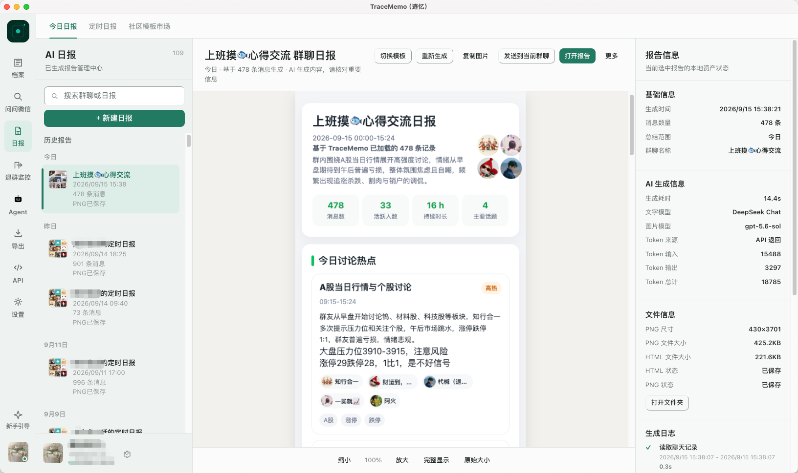
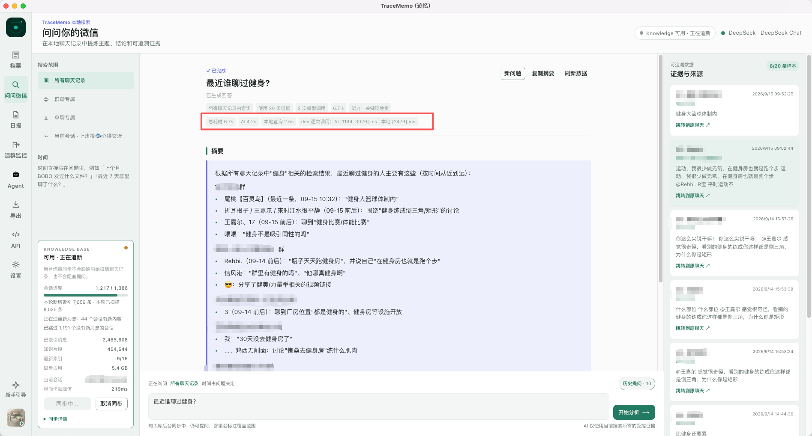
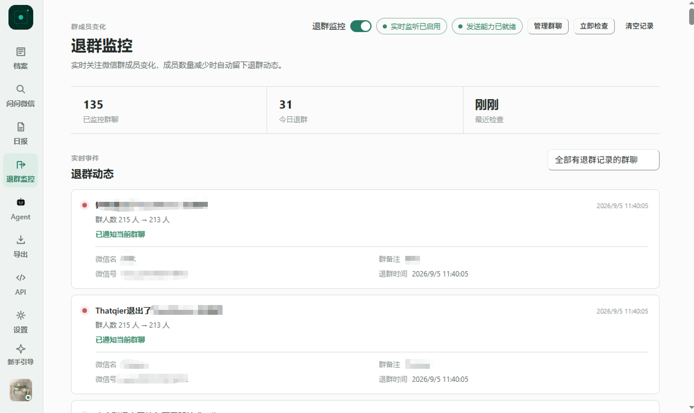

# TraceMemo（迹忆）

> ⚠️ **本仓库是 [Claudate/wechat-team](https://github.com/Claudate/wechat-team) 的个人定制 fork**（Chat_Monitor_for_Tencent）。
> 在原版「微信档案 + AI + 日报」的基础上，本 fork **新增了 QQ（通过 SnowLuma / OneBot v11）监控**，并把微信侧和 QQ 侧对齐：监听群置顶、关键成员高亮、群号/群名快筛、按日期或条数拉取历史、一键 AI 群分析。
> **原版的能力、文档与致谢仍然适用**；下方标注 🆕 的为本 fork 新增/改动。

  

<h2 align="center">把微信和 QQ 里的信息，记住、理解、监控，并在需要时行动</h2>

本地优先的微信 / QQ 数据、AI 分析与自动化工作台

  <a href="https://github.com/bluemaiding/Chat_Monitor_for_Tencent"><b>本 fork 仓库</b></a>
  ·
  <a href="https://github.com/Claudate/wechat-team"><b>上游原版</b></a>
  ·
  <a href="./docs/user-guide/getting-started.md"><b>第一次使用</b></a>
  ·
  <a href="./docs/README.md"><b>完整文档</b></a>

  

  

  

---

## 🎨 社区日报模板

TraceMemo 日报除了内置版式，也支持从社区模板市场安装更多样式。社区模板与默认日报读取同一份真实日报数据，只改变展示方式，适合手机长图分享、桌面归档、团队复盘等不同场景。

  <a href="https://github.com/Wxw-Gu/TraceMemo-Templates"><b>浏览 TraceMemo 模板社区</b></a>
  ·
  <a href="https://github.com/Wxw-Gu/TraceMemo-Templates/tree/main/skills/tracememo-template-contributor"><b>用 AI 制作并投稿模板</b></a>

在 TraceMemo 中打开：

**日报 → 今日日报 → 日报模板 → 模板市场**

即可查看、预览、安装和切换已发布的社区模板。

如果你有一张喜欢的日报长图、网页或前端项目，也可以把它交给 Codex、ChatGPT 或其他能够读取 GitHub 仓库的 AI，并让它读取 [TraceMemo Template Contributor Skill](https://github.com/Wxw-Gu/TraceMemo-Templates/tree/main/skills/tracememo-template-contributor)。AI 可以帮助你完成模板转换、真实预览，并在你确认满意后向 [TraceMemo-Templates](https://github.com/Wxw-Gu/TraceMemo-Templates) 提交 Pull Request。

模板通过审核并正式发布后，其他 TraceMemo 用户即可在模板市场中安装使用。

---

## TraceMemo 是什么

TraceMemo（迹忆）原名 **WechatExplorer** 是一款本地优先的微信数据、AI 分析与自动化工作台，把聊天变成可浏览、可搜索、可理解、可追溯的信息。

先用档案找原话，再按需要使用 AI Search、日报、监控或 Agent。普通浏览、搜索和导出不需要 AI。

## 核心能力

- 💬 **聊天档案与搜索**：浏览会话，按关键词或身份信息查找。
- 🔍 **AI Search / 问问微信**：用自然语言找回模糊记忆，并查看来源。
- 🧠 **本地知识库**：建立索引，提升跨会话查询稳定性。
- 📊 **群聊日报**：生成今日、昨日或近 7 天的群聊总结。
- 👀 **群成员变化监控**：记录指定群聊的退群动态。
- 🔊 **文字转语音**：生成语音，试听后发送到选定会话。
- 🤖 **Agent Hub**：在微信里调用本机 TraceMemo。
- 🔌 **外部 Agent / Local HTTP API**：让外部 Agent 查询本机微信历史。

### 🆕 本 fork 新增：QQ 支持 + 微信/QQ 对齐的监控体验

- 🐧 **QQ 接入（SnowLuma / OneBot v11）**：应用内一键启动/停止 SnowLuma、查看日志、打开 WebUI，连接后即可浏览 QQ 群与消息。
- 📥 **按日期 / 条数拉取 QQ 历史**：今天 / 近三天 / 近一周快捷预设，或自定义日期范围；也可拉最近 200/500/1000 条或全部本地缓存（靠 `message_id` 锚点自动翻页）。
- 🤖 **QQ 群 AI 分析**：勾选板块（话题热点 / 关键结论 / 待办 / 风险 / 时间线 / 成员动态 / 氛围）+ 风格模板（简报 / 详细 / 日报式），用你配置的 DeepSeek 等模型一键总结。
- ⭐ **监听群置顶**（微信 + QQ）：给群点 ☆ 监听，被监听的群排到列表最上面。
- 🧑‍‍🧑 **关键成员高亮**（微信 + QQ）：关注某人后，其消息整条高亮，微信侧复用已有的「关注成员」体系。
- 🔎 **会话快筛**（微信 + QQ）：只看群 / 只看监听 / 群号或群名搜索。

## 💻 平台支持

TraceMemo 支持：

- **Windows x64**（本 fork 主要使用与验证的平台）
- **macOS Apple Silicon（M 系列 / arm64）**
- **macOS Intel（x64）**

Windows 与 macOS 均支持微信本地数据库连接与数据库 Key 获取。 QQ 能力通过 SnowLuma（OneBot v11）实现，Windows 下已在应用内集成启动器。

## 项目缘起

TraceMemo 最早叫 **WechatExplorer**。

**2025 年 12 月**，我做出了第一个版本。当时功能很简单：解析微信 3.0 的聊天记录，再用 AI 生成群聊日报。最初只是给自己用，想把散落在微信里的信息重新找出来，也方便看看群里每天聊了什么。

第一个版本完成后，项目搁置了一段时间。后来重新捡起来，我还是想继续做群聊日报，但微信已经更新到 4.x，原来的微信 3.0 数据解析方案不再适用。

为了支持微信 4.x，我开始重新研究数据访问。这部分工作最初得到了 **WeFlow** 很大的帮助。早期 TraceMemo 曾参考 WeFlow 历史版本中的实现和思路，借此解决了数据库消息、密钥获取等微信 4.x 数据访问问题。

随着项目继续发展，我逐步把这部分底层能力从原有实现中抽离，并重新实现了一套独立的数据访问兼容层。目前会继续保持与 WeFlow 历史接口和行为的兼容，以减少上层业务迁移成本。

也就是说，**WeFlow 是 TraceMemo 进入微信 数据访问领域的重要起点。没有 WeFlow，就没有今天的 TraceMemo。**

在此基础上，项目陆续加入了：

- 本地知识库
- 消息来源追溯
- 群聊日报
- 语音消息也参与知识库等问答
- 微信机器人
- Local HTTP API
- Reader Skill
- Agent 接入
- 多种聊天记录导出能力
- 退群监控
- 文字转语音
- 持续监控自动化能力

群聊日报后来被一些人看到，项目也开始有了 Star、Fork、使用反馈和功能建议。说实话，我一开始没想到，这个原本只给自己用的小工具，会得到这么多人的关注。

这些关注和反馈让我决定认真把项目继续做下去。WechatExplorer 就这样一步一步变成了今天的 **TraceMemo（迹忆）**。

感谢每一位使用、关注和反馈过的人。

---

## 💬 交流与反馈

  

**这个图显然是过期了，可以考虑联系原作者**

## 从你的任务开始

| 想做什么                           | 使用入口                      |
| ---------------------------------- | ----------------------------- |
| 找记得原文或关键词的消息           | 档案搜索                      |
| 找记得大意、但不知道在哪聊过的内容 | AI Search / 问问微信          |
| 长期跨群查询历史                   | 本地知识库                    |
| 了解一个群今天或近 7 天聊了什么    | 群聊日报                      |
| 持续关注群成员退出                 | 退群监控                      |
| 按计划生成并发送群聊日报           | 定时日报                      |
| 把文字生成微信语音                 | 文字转语音                    |
| 在微信里向本机 TraceMemo 提问      | Agent Hub                     |
| 让 Codex 等工具查询微信历史        | Reader Skill / Local HTTP API |
| 把聊天保存成文件                   | 导出                          |

## 快速开始

> 本 fork 不单独发布安装包，请自行从源码构建（见下方「本地构建」与 [CONTRIBUTING.md](./CONTRIBUTING.md)）。原版安装包在上游 [Claudate/wechat-team Releases](https://github.com/Claudate/wechat-team/releases)。

1. 克隆本仓库并 `pnpm install`，`pnpm build:win` 后运行 `dist/win-unpacked/TraceMemo.exe`。
2. 启动应用，按"第一次使用"页面选择微信数据目录并完成连接。
3. 需要 QQ：在应用「QQ」页点「启动 SnowLuma」，首次会弹出 WebUI（`http://127.0.0.1:5099`），扫码登录 QQ 后在「协议端点 → HTTP API」建端点，回到本应用填地址 + token 点「连接」。
4. 需要 AI 时，在"设置 → AI 模型"添加并测试 Provider（微信日报、QQ 群分析共用）。

详细步骤见[第一次使用 TraceMemo](./docs/user-guide/getting-started.md)。

## 文档

- [用户指南](./docs/README.md#用户指南)
- [AI / Knowledge](./docs/README.md#ai-与知识库)
- [Monitor / Automation](./docs/README.md#日报与自动化)
- [Agent / API](./docs/README.md#agent--api)
- [开发文档](./docs/development/overview.md)
- [隐私与安全](./docs/user-guide/privacy.md)

完整目录由[文档首页](./docs/README.md)维护。

## 支持平台

| 平台    | 架构                           | 微信连接                              | 安装包                          |
| ------- | ------------------------------ | ------------------------------------- | ------------------------------- |
| Windows | x64                            | 支持微信 4.x；QQ 经 SnowLuma 已集成   | 自行构建 `dist/win-unpacked`    |
| macOS   | Apple Silicon（M 系列、arm64） | 自动获取数据库 Key，已适配微信 4.1.13 | 上游 Releases |
| macOS   | Intel（x64）                   | 自动获取数据库 Key，已适配微信 4.1.13 | 上游 Releases |

## 参与贡献

本仓库是个人 fork，定制改动放在 **`blue-version`** 分支（`main` 保留与上游同步的内容）。

- 想直接用上本 fork 的 QQ / 监控能力：切到 `blue-version` 分支自行构建。
- 想把改动贡献回上游：请遵循上游 [Claudate/wechat-team](https://github.com/Claudate/wechat-team) 的流程——**基于 `develop` 拉分支、PR 目标设为 `develop`**，指向 `main` 的 PR 会被关闭。

分支流程、提交信息风格、PR 前自检、**本地构建（含 Windows 的 Go / winCodeSign 等坑）与 SnowLuma 环境搭建**，都在[参与贡献指南](./CONTRIBUTING.md)。

## 致谢

TraceMemo 的诞生离不开开源社区中许多优秀项目的工作。

### 特别感谢 WeFlow

TraceMemo 在早期适配微信 4.x 时，曾参考 **[WeFlow](https://github.com/hicccc77/WeFlow)** 历史版本中的相关实现和思路，包括数据库访问、密钥获取等底层能力。

特别感谢作者 **[hicccc77](https://github.com/hicccc77)**。项目与 WeFlow 的具体关系见[项目缘起](#项目缘起)。

### 其他参考项目

- **[WechatMessageExplorer](https://github.com/svcvit/WechatMessageExplorer)**
  - 提供了数据解析相关思路。

- **[chatlog](https://github.com/sjzar/chatlog)**
  - 提供了数据处理方面的参考。

- **[wechat_chatter](https://github.com/yincongcyincong/wechat_chatter)**
  - 提供了发送方面的参考。

感谢所有开源作者，也感谢所有帮助 TraceMemo 发现问题、提出建议和持续使用它的人。

---

## 最后说两句

这个项目起初只是一个一时兴起的项目，所以它大概也不会有一份特别严肃的产品路线图。

我可能会按照自己的兴趣继续折腾，也可能突然加入一些奇奇怪怪、但觉得有意思的功能—— 比如让AI给某个好友, 某个群发一个语音条(逗逗群友) 或者定时生成群聊日报并做成微信卡片。

也因此，这个项目随时可能继续折腾，也可能因为其他事情暂时搁置。如果你有想要的功能，可以提Issue；如果觉得现有实现不符合你的需求，也欢迎直接 Fork 后自己改。

  <b>TraceMemo（迹忆）</b>
   
  把微信聊过的事，找回来、问清楚、留下来。

